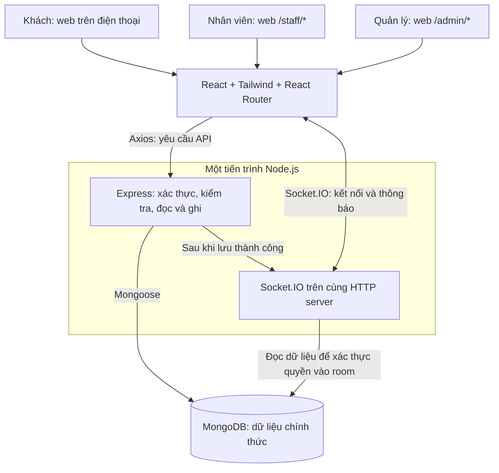
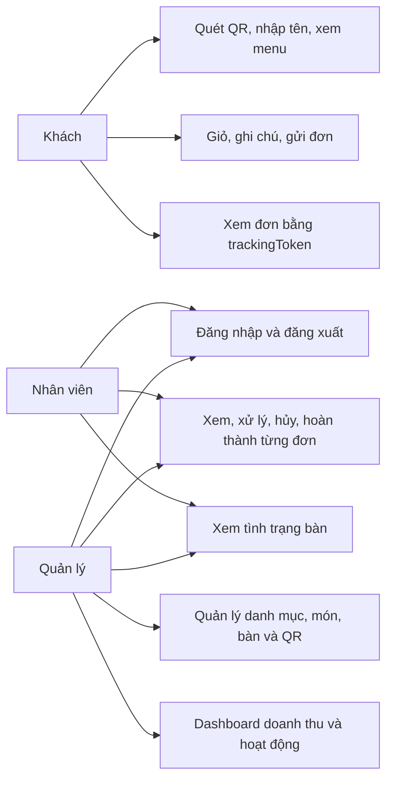
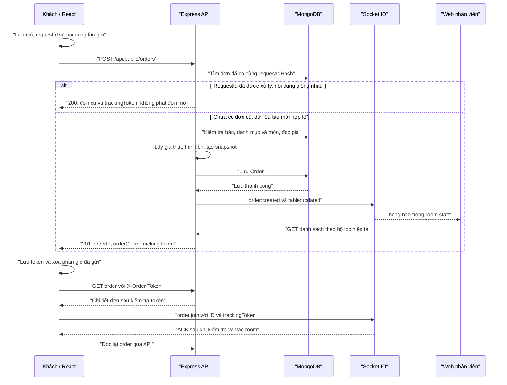
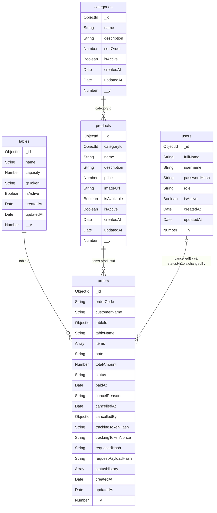
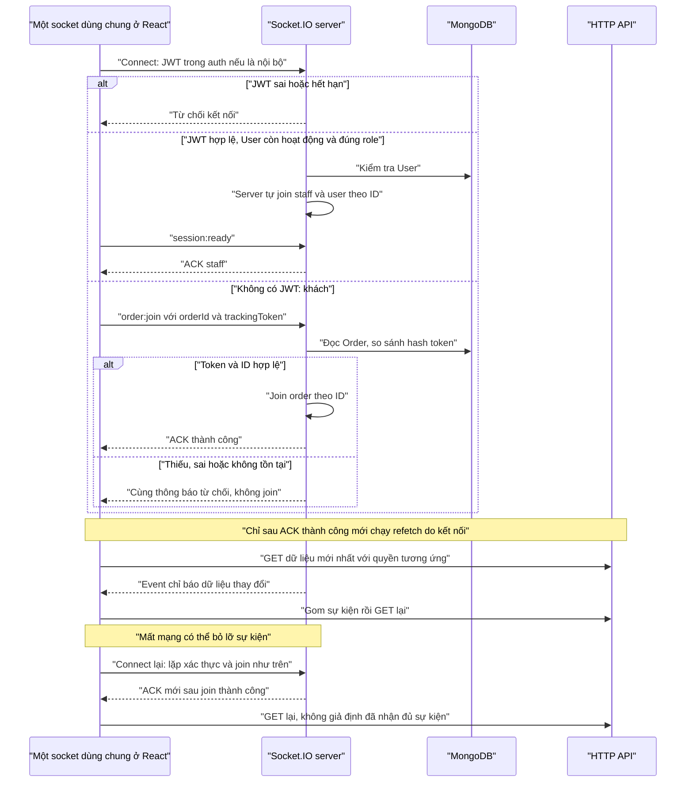

# Tài liệu bảo vệ khóa luận

**Đề tài:** Xây dựng hệ thống quản lý nhà hàng/cafe và gọi món bằng mã QR.  
**Đối chiếu source:** 18/09/2026, lượt 9C chỉ viết tài liệu.

> Bản trong thư mục này có chức năng đến giai đoạn 8. Khi bắt đầu 9C không có GIAI_DOAN_9.md, tài liệu triển khai 9B hoặc script `reset:demo` / `seed:demo` trong [server/package.json](server/package.json). Không suy đoán những phần đó đã được triển khai. Tài liệu này mô tả source thực sự đã đọc; các điểm khác tài liệu cũ nằm trong [GIAI_DOAN_9.md](GIAI_DOAN_9.md). Hướng dẫn chạy là bản local/LAN đã đối chiếu, chưa phải xác nhận triển khai 9B.

## 1. Mở đầu trong khoảng 45 giây

“Đề tài của em hỗ trợ khách tại quán tự xem thực đơn, ghi chú và gửi yêu cầu gọi món bằng điện thoại. Nhân viên nhận đơn tập trung, xử lý theo từng bước; khách theo dõi được tiến độ. Quản lý cập nhật danh mục, món, bàn và xem doanh thu đã xác nhận thanh toán. Em tập trung vào tính đúng của đơn hàng: server tự tính tiền, giữ giá lịch sử, chống gửi trùng và chống hai nhân viên ghi đè trạng thái.”

Đây là mục tiêu và chức năng đã triển khai, chưa có số đo để khẳng định giảm bao nhiêu phần trăm thời gian phục vụ. Các màn hình thực tế nằm trong hàm `AppRoutes` tại [AppRoutes.jsx](client/src/routes/AppRoutes.jsx); nghiệp vụ chính nằm trong `createGuestOrder` tại [orderService.js](server/src/services/orderService.js) và `changeOrderStatus` tại [orderWorkflowService.js](server/src/services/orderWorkflowService.js).

## 2. Người dùng, chức năng và công nghệ

| Người dùng | Được làm gì trong bản hiện có | Code đối chiếu |
|---|---|---|
| Khách | QR, nhập tên, menu theo danh mục, giỏ/ghi chú, gửi và xem từng đơn | `CustomerMenuPage`, `CartPage`, `OrderPage` trong [routes](client/src/routes/AppRoutes.jsx); [publicMenuRoutes.js](server/src/routes/publicMenuRoutes.js) |
| Staff | Đăng nhập, xem/lọc đơn, xử lý/hủy/hoàn thành từng đơn, xem bàn | [orderRoutes.js](server/src/routes/orderRoutes.js), [catalogRoutes.js](server/src/routes/catalogRoutes.js) |
| Admin | Chức năng staff, quản lý danh mục/món/bàn/QR, dashboard | [catalogRoutes.js](server/src/routes/catalogRoutes.js), `createDashboardRouter` trong [dashboardRoutes.js](server/src/routes/dashboardRoutes.js) |

Khách không có User và không dùng JWT. Admin **chưa có màn hình/API quản lý tài khoản nhân viên**; tài khoản được tạo bằng lệnh nội bộ `create:user`. `/admin` chỉ hiển thị tài khoản đang đăng nhập, kiểm tra quyền và đăng xuất. Căn cứ: [User.js](server/src/models/User.js), `createInternalUser` trong [userService.js](server/src/services/userService.js), `InternalWelcome` trong [InternalWelcome.jsx](client/src/components/InternalWelcome.jsx).

| Công nghệ | Cách dùng và lý do phù hợp project | Nơi đọc |
|---|---|---|
| React + React Router | Viết thành phần giao diện, chuyển trang và dùng lại màn hình đơn cho staff/admin | [main.jsx](client/src/main.jsx), `AppRoutes` trong [AppRoutes.jsx](client/src/routes/AppRoutes.jsx) |
| Tailwind CSS | Kiểu giao diện, bố cục thích ứng điện thoại bằng class, không cần thêm bộ UI | [index.css](client/src/index.css), [vite.config.js](client/vite.config.js) |
| Axios | Gọi API, xử lý timeout, gắn JWT cho nội bộ; khách có client riêng | [axiosClient.js](client/src/api/axiosClient.js), [publicMenuApi.js](client/src/api/publicMenuApi.js) |
| Node.js + Express | Cùng ngôn ngữ JavaScript, route dễ đọc, tập trung kiểm tra quyền và nghiệp vụ | `createApp` trong [app.js](server/src/app.js), `startServer` trong [server.js](server/src/server.js) |
| MongoDB + Mongoose | Lưu Order gồm các dòng món/lịch sử; schema kiểm tra kiểu và giới hạn | [Order.js](server/src/models/Order.js), `connectDatabase` trong [database.js](server/src/config/database.js) |
| JWT + bcrypt | Xác thực nội bộ; băm mật khẩu thay vì lưu mật khẩu gốc | [token.js](server/src/utils/token.js), [userService.js](server/src/services/userService.js) |
| Socket.IO | Báo dữ liệu đổi, chia người nhận bằng room, hỗ trợ nối lại | `initializeRealtime` trong [realtimeServer.js](server/src/sockets/realtimeServer.js) |
| qrcode | Tạo PNG lúc admin xem/tải, không lưu ảnh vào DB | `getTableQr` trong [tableController.js](server/src/controllers/tableController.js) |
| Chart.js | Một thư viện biểu đồ cột; chỉ tải phần dashboard khi mở trang | `RevenueChart` trong [RevenueChart.jsx](client/src/components/RevenueChart.jsx), [AppRoutes.jsx](client/src/routes/AppRoutes.jsx) |

Vite phục vụ phát triển và build frontend. Backend dùng sẵn `--env-file`, `--watch` của Node; không có dotenv/nodemon, Redux, Redis hoặc thư viện realtime thứ hai. Danh sách dependency và lệnh thật: [client/package.json](client/package.json), [server/package.json](server/package.json).

## 3. Kiến trúc và luồng quét QR

Frontend là web chạy trên trình duyệt, bao gồm cả `/staff/*`; chưa có ứng dụng di động cài riêng. Express và Socket.IO chạy cùng một HTTP server; MongoDB nằm phía backend. Route chọn hàm xử lý, middleware kiểm tra quyền, controller nhận/trả HTTP; service tập trung nghiệp vụ đơn và thống kê. Căn cứ: `AppRoutes`, `createApp`, `startServer` tại [routes React](client/src/routes/AppRoutes.jsx), [app.js](server/src/app.js), [server.js](server/src/server.js).

1. Admin mở QR; `getTableQr` tạo URL từ `PUBLIC_APP_URL` và `qrToken`, trả PNG. Xem [tableController.js](server/src/controllers/tableController.js).
2. Điện thoại mở `/menu/:qrToken`; `getPublicTable` kiểm tra token 48 ký tự hex, bàn tồn tại và hoạt động. QR sai trả 404, bàn tắt trả 403. Xem [publicMenuController.js](server/src/controllers/publicMenuController.js).
3. `MenuForTable` yêu cầu tên 1–100 ký tự, rồi tải danh mục/món đang hiện; tên không cấp quyền. Xem [CustomerMenuPage.jsx](client/src/pages/customer/CustomerMenuPage.jsx).
4. `CartProvider` dùng giỏ riêng theo QR trong localStorage; thêm, tăng/giảm, xóa và ghi chú. Xem [CartContext.jsx](client/src/contexts/CartContext.jsx), `cartKey`, `readCart`, `writeCart` trong [guestStorage.js](client/src/utils/guestStorage.js).
5. `CartPage.submit` gửi API; chỉ sau kết quả và lưu token thành công mới xóa phần món/ghi chú, chuyển trang đơn. Xem [CartPage.jsx](client/src/pages/customer/CartPage.jsx), `finishSubmission` trong [CartContext.jsx](client/src/contexts/CartContext.jsx).

QR chỉ nhận diện bàn, không chứng minh vị trí khách. Biết QR không được đọc mọi đơn tại bàn; API xem đơn có kiểm tra token riêng. Hai lớp kiểm tra nằm ở `getPublicTable` và `getPublicOrder`: [publicMenuController.js](server/src/controllers/publicMenuController.js), [publicOrderController.js](server/src/controllers/publicOrderController.js).

## 4. Database, giá và chống gửi trùng

Collection là nhóm bản ghi cùng loại; document là một bản ghi. Có năm collection nghiệp vụ, được tạo qua `mongoose.model`: [User.js](server/src/models/User.js), [Category.js](server/src/models/Category.js), [Product.js](server/src/models/Product.js), [Table.js](server/src/models/Table.js), [Order.js](server/src/models/Order.js). Sơ đồ ở mục 11 ghi các trường nghiệp vụ đúng schema; `items` và `statusHistory` là mảng nhúng, không phải collection riêng.

| Collection | Nội dung |
|---|---|
| users | Tài khoản admin/staff: fullName, username, passwordHash, role, isActive |
| categories | Nhóm món: name, description, sortOrder, isActive |
| products | categoryId, name, description, price, imageUrl, isAvailable, isActive |
| tables | name, capacity, qrToken, isActive; **không có status bàn** |
| orders | Mã/tên khách/bàn, snapshot món, ghi chú/tổng, trạng thái/lịch sử, thanh toán/hủy, hash bảo vệ/chống trùng |

Mỗi schema bật timestamps (`createdAt`, `updatedAt`); có `_id`, và Mongoose có thể lưu `__v` làm trường quản lý phiên bản. `items` và phần tử `statusHistory` cấu hình `_id:false`. Nguồn: các schema liên kết ngay trên.

**Backend tự tính tiền:** `validateOrder` chỉ lấy mã món, số lượng, ghi chú, QR/tên khách; giới hạn 1–99 mỗi món và tối đa 50 món khác nhau. `createGuestOrder` đọc bàn, món còn bán/còn hàng, danh mục đang hiện; dùng `Product.price` từ DB để tính `lineTotal = unitPrice × quantity`, rồi cộng `totalAmount`. Giá, tổng, tên món hoặc status tự gửi từ frontend không làm dữ liệu chính thức. Xem [orderValidation.js](server/src/utils/orderValidation.js), [orderService.js](server/src/services/orderService.js).

**Snapshot** là dữ liệu chụp lại lúc đặt: `tableName`, `productName`, `unitPrice`, `lineTotal`. Đổi giá/tên Product sau đó không sửa đơn cũ. Giá trong giỏ là tạm tính; nếu admin đổi giá trước lần server đọc món để tạo đơn, tổng chính thức có thể khác giỏ. Xem `createGuestOrder` trong [orderService.js](server/src/services/orderService.js), `getPublicOrder` trong [publicOrderController.js](server/src/controllers/publicOrderController.js).

**requestId chống trùng:** `prepareSubmission` tạo 32 byte ngẫu nhiên, lưu mã và nội dung trước POST; mất phản hồi giữ lại cùng lần gửi. Backend lưu `requestIdHash` với unique index, tức chỉ mục không cho hai document dùng cùng giá trị. Cùng mã và nội dung trả đơn cũ (200, `replayed:true`); nội dung khác trả 409; lần mới trả 201. `findPrevious` kiểm tra trước khi đọc menu để retry vẫn nhận đơn cũ sau khi món/bàn bị tắt. Xem [CartContext.jsx](client/src/contexts/CartContext.jsx), `newRequestId` trong [guestStorage.js](client/src/utils/guestStorage.js), `createGuestOrder` trong [orderService.js](server/src/services/orderService.js), [Order.js](server/src/models/Order.js).

Mã mới sau một lần đặt thành công tạo đơn mới, kể cả cùng bàn và cùng món. Chống trùng không tự gộp các requestId khác nhau; `requestId` cũng cần giữ riêng vì cùng mã/nội dung cho phép lấy lại trackingToken. Một món chỉ có một dòng khi gửi qua API hiện tại, ghi chú áp dụng cho dòng đã gộp. Nguồn: `validateOrder`, `creationResult`, `CartProvider.addItem` ở các file trên.

## 5. Xác thực, phân quyền và bảo mật

**Authentication — xác thực:** kiểm tra phiên thuộc tài khoản nào. `login` so sánh mật khẩu bằng bcrypt; `createAccessToken` ký JWT HS256, `sub` là userId, thời hạn 2 giờ, có issuer/audience. JWT có chữ ký, không phải dữ liệu được mã hóa để giấu nội dung. Code chỉ đưa định danh/thông tin xác thực vào token. Xem [authController.js](server/src/controllers/authController.js), [token.js](server/src/utils/token.js).

**Authorization — phân quyền:** `requireAuth` đọc lại User còn hoạt động và role nội bộ ở từng API; `requireRoles` kiểm tra quyền chức năng. `ProtectedRoute` chỉ hỗ trợ giao diện, không thay kiểm tra backend. Xem [authMiddleware.js](server/src/middlewares/authMiddleware.js), [ProtectedRoute.jsx](client/src/routes/ProtectedRoute.jsx).

JWT nằm trong sessionStorage, khóa `restaurant_qr_access_token`; Axios gắn header Authorization cho API nội bộ. `logout` xóa phiên tab và gọi API ngắt các socket của user khi có mạng, nhưng chưa có danh sách thu hồi token bị sao chép hoặc refresh token. Xem [authStorage.js](client/src/utils/authStorage.js), [axiosClient.js](client/src/api/axiosClient.js), [AuthContext.jsx](client/src/contexts/AuthContext.jsx), [authController.js](server/src/controllers/authController.js).

**trackingToken:** khách không đăng nhập nên mỗi đơn có một mã bí mật. Backend sinh nonce ngẫu nhiên, dùng HMAC-SHA256 với `ORDER_TOKEN_SECRET` để tạo token; DB lưu hash SHA-256 và nonce, không lưu token thật. HMAC là cách tạo mã có dùng khóa bí mật, giúp retry tái tạo cùng token; hash là dấu kiểm tra một chiều. `matchesTrackingToken` dùng so sánh thời gian ổn định. Xem [orderToken.js](server/src/utils/orderToken.js), `creationResult` trong [orderService.js](server/src/services/orderService.js).

Trình duyệt giữ token thật trong danh sách đơn thuộc localStorage theo QR; GET đơn gửi `X-Order-Token`, socket gửi trực tiếp khi `order:join`. Sai/thiếu token hoặc ID sai/không tồn tại đều không trả chi tiết. Ai giữ token thật có quyền đọc đơn; mất storage/đổi origin/đổi thiết bị không tự khôi phục được. Xem `findSavedOrder` trong [guestStorage.js](client/src/utils/guestStorage.js), `getPublicOrder` trong [publicOrderController.js](server/src/controllers/publicOrderController.js), `initializeRealtime` trong [realtimeServer.js](server/src/sockets/realtimeServer.js).

| Đã có | Code chứng minh | Giới hạn cần nói đúng |
|---|---|---|
| bcrypt cost 12, không trả passwordHash | `createInternalUser` trong [userService.js](server/src/services/userService.js), [userResponse.js](server/src/utils/userResponse.js) | Không phải mã hóa có thể giải ngược mật khẩu |
| Giới hạn login sai 10 lần/15 phút theo IP | `loginLimiter` trong [authRoutes.js](server/src/routes/authRoutes.js) | Bộ nhớ một tiến trình, chưa giới hạn số order theo khách |
| Kiểm tra kiểu, field được phép và giới hạn JSON 100KB | [catalogValidation.js](server/src/utils/catalogValidation.js), [orderValidation.js](server/src/utils/orderValidation.js), `createApp` trong [app.js](server/src/app.js) | Không phải bằng chứng miễn nhiễm mọi loại tấn công |
| Không log JWT/trackingToken trong code nghiệp vụ; payload socket nhỏ | [notifications.js](server/src/sockets/notifications.js), [errorHandler.js](server/src/middlewares/errorHandler.js) | Người demo không chiếu header/storage chứa token |
| CORS và kiểm tra Origin socket | [app.js](server/src/app.js), [realtimeServer.js](server/src/sockets/realtimeServer.js) | Không thay xác thực; chưa có cấu hình HTTPS/reverse proxy trong source |
| Tách cấu hình riêng và file mẫu | [server/.env.example](server/.env.example), [client/.env.example](client/.env.example), [.gitignore](.gitignore) | Không đặt secret trong biến VITE_ hoặc slide |

**XSS** là mã JavaScript không mong muốn chạy trong trang. Vì JWT trong sessionStorage và token khách trong localStorage đều đọc được bằng JavaScript, nếu có XSS thì chúng có thể bị lấy hoặc dùng để gửi API. Hiện chưa có cookie HttpOnly hay chính sách CSP được cấu hình trong ứng dụng; không tuyên bố đã giải quyết triệt để XSS. Căn cứ nơi lưu: [authStorage.js](client/src/utils/authStorage.js), [guestStorage.js](client/src/utils/guestStorage.js); cấu hình hiện có: [app.js](server/src/app.js), [index.html](client/index.html).

## 6. Xử lý đơn, lịch sử và bàn

| Hiện tại | Đích hợp lệ |
|---|---|
| pending | confirmed hoặc cancelled |
| confirmed | preparing hoặc cancelled |
| preparing | served |
| served | completed |
| completed, cancelled | Không đổi tiếp |

Nguồn quy tắc: `orderTransitions` trong [orderStatus.js](server/src/utils/orderStatus.js). `changeOrderStatus` kiểm tra ở backend; không cho bỏ bước vì tiếp nhận, chế biến, phục vụ và thu tiền là những việc khác nhau. Xem [orderWorkflowService.js](server/src/services/orderWorkflowService.js).

`statusHistory` ghi status, thời gian server và ID người xử lý; pending của khách có changedBy=null. Tên nhân viên trong API nội bộ được lấy từ User hiện tại, **chưa snapshot tên nhân viên**. Trang khách không hiện tên nhân viên; API public hiện vẫn trả ID `statusHistory.changedBy`, nên không nói rằng phản hồi public hoàn toàn không có định danh nội bộ. Căn cứ: `readInternalOrder` trong [orderWorkflowService.js](server/src/services/orderWorkflowService.js), `getPublicOrder` trong [publicOrderController.js](server/src/controllers/publicOrderController.js), `OrderSummary` trong [OrderSummary.jsx](client/src/components/OrderSummary.jsx).

Hủy chỉ từ pending/confirmed, bắt buộc lý do, lưu cancelledAt/cancelledBy và lịch sử, không xóa Order. Completed chỉ từ served, nghĩa là staff xác nhận đã nhận tiền; `paidAt` là lúc server xử lý bước đó, không phải thời gian xác minh ngân hàng. Form có checkbox xác nhận thanh toán. Xem `orderChangeBody` trong [internalOrderValidation.js](server/src/utils/internalOrderValidation.js), `changeOrderStatus` trong [orderWorkflowService.js](server/src/services/orderWorkflowService.js), `Detail.apply` trong [OrderDetailPage.jsx](client/src/pages/staff/OrderDetailPage.jsx).

**Hai staff cùng xử lý:** frontend gửi expectedStatus đang nhìn thấy. Lệnh `findOneAndUpdate` lọc ngay khi ghi bằng `_id` và status cũ, đồng thời đổi trạng thái và thêm lịch sử. Một người ghi trước; yêu cầu cũ của người kia nhận 409, tải lại, không tự chuyển tiếp. Đây là cập nhật nguyên tử trên một document, không phải transaction nhiều document. Xem `changeOrderStatus` tại [orderWorkflowService.js](server/src/services/orderWorkflowService.js), xử lý 409 trong [OrderDetailPage.jsx](client/src/pages/staff/OrderDetailPage.jsx).

**Bàn bận** khi còn ít nhất một order pending/confirmed/preparing/served. A completed nhưng B preparing thì bàn vẫn bận; tất cả completed/cancelled thì trống. `isActive=false` chỉ tắt nhận đơn mới, không bỏ đơn cũ; “trống” không chứng minh khách đã rời ghế. Tình trạng được tính ở `listTables` trong [tableController.js](server/src/controllers/tableController.js) bằng `activeOrderStatuses` trong [orderStatus.js](server/src/utils/orderStatus.js).

## 7. Socket.IO và phục hồi kết nối

Room là nhóm socket do server chọn người được tham gia. `staff` dành cho staff/admin có JWT hợp lệ và User còn hoạt động; server tự join trong middleware. `user:<userId>` để ngắt các kết nối của cùng tài khoản. `order:<orderId>` cần trackingToken đúng, chỉ nghe đơn đó; không có event client tự xin vào staff. Xem `initializeRealtime` trong [realtimeServer.js](server/src/sockets/realtimeServer.js).

| Event server phát | Sau thao tác | Room | Payload chính xác |
|---|---|---|---|
| order:created | Ghi đơn mới thành công | staff | orderId, orderCode, tableId, tableName |
| order:updated | Ghi bước confirmed/preparing/served/completed | staff và order:id | orderId, status, updatedAt |
| order:cancelled | Hủy thành công | staff và order:id | orderId, status, updatedAt, cancelReason |
| table:updated | Tạo đơn, completed, cancelled | staff | tableId |

Nguồn: `notifyOrderCreated`, `notifyOrderUpdated`, `safelyNotify` trong [notifications.js](server/src/sockets/notifications.js). Chỉ phát sau khi MongoDB xác nhận lần ghi thành công; retry requestId cũ không phát order:created lần hai. Try/catch giữ lỗi thông báo không làm API ghi thành công báo thất bại; chưa khởi tạo io thì không làm gì. Chưa có hàng đợi phát lại khi tiến trình dừng đúng giữa ghi DB và emit.

API vẫn tạo/đổi/hủy/đọc dữ liệu; socket chỉ báo để client GET lại. Mỗi tab có một đối tượng socket chung, listener gỡ bằng đúng handler. Staff và khách thường gom thông báo trong 300ms; dashboard gom 1,5 giây. Căn cứ: [socket.js](client/src/realtime/socket.js), `useRealtimeRefresh` trong [useRealtimeRefresh.js](client/src/realtime/useRealtimeRefresh.js), `useDashboard` trong [useDashboard.js](client/src/hooks/useDashboard.js).

Sau **mọi connect, kể cả reconnect**: vào lại room → chờ ACK (xác nhận đã vào) → refetch API. Staff đợi `session:ready`; khách gửi lại `order:join`. Trang khách gọi API đầu tiên để xác minh quyền rồi mới kết nối socket; lần GET sau ACK bù thay đổi giữa lần đọc đầu và lúc vào room. Tab khách hiện lại cũng đọc API. Xem `useSocketSession` trong [useSocketSession.js](client/src/realtime/useSocketSession.js), `OrderDetails` trong [OrderPage.jsx](client/src/pages/customer/OrderPage.jsx).

Mất socket nhưng API còn truy cập được thì vẫn đặt/xử lý/làm mới đơn. Mất toàn bộ mạng thì API cũng không gửi được; giỏ giữ lần gửi để thử lại. Reconnect không bảo đảm nhận lại từng event cũ, nên phải đọc dữ liệu mới từ MongoDB qua API. Nguồn: [CartPage.jsx](client/src/pages/customer/CartPage.jsx), [useSocketSession.js](client/src/realtime/useSocketSession.js), [useRealtimeRefresh.js](client/src/realtime/useRealtimeRefresh.js).

## 8. Dashboard và giờ Việt Nam

Aggregation là cho MongoDB xử lý qua nhiều bước: `$match` lọc, `$unwind` tách dòng món, `$group/$sum` nhóm và cộng, `$sort/$first` chọn tên snapshot mới nhất. Backend trả các con số/danh sách nhỏ, frontend không tải toàn bộ Order để cộng. Nguồn các hàm `dashboardSummary`, `dashboardRevenue`, `dashboardProducts`, `dashboardRecentOrders` trong [dashboardService.js](server/src/services/dashboardService.js).

| Chỉ số | Điều kiện / field thời gian |
|---|---|
| revenue, completedOrders, averageOrderValue, Top món | completed và paidAt kiểu Date trong kỳ; revenue cộng totalAmount; trung bình chia completedOrders, không có thì 0 |
| totalOrders | createdAt trong kỳ, mọi status |
| cancelledOrders | createdAt trong kỳ, hiện đã cancelled; không phải số lần hủy theo cancelledAt |
| activeOrders, activeTables, emptyTables | Tình trạng hiện tại, mọi ngày; gồm cả bàn tắt nhận đơn mới |
| recent-orders | createdAt trong kỳ, sort createdAt desc rồi _id desc, mặc định 10 |
| dataWarnings.completedWithoutPaidAt | completed thiếu/sai kiểu paidAt trong toàn DB |

Các công thức nằm trong [dashboardService.js](server/src/services/dashboardService.js). CancelledOrders của ngày cũ có thể tăng nếu đơn ngày đó bị hủy sau này, nhưng luôn ≤ totalOrders. CompletedOrders có thể lớn hơn totalOrders cùng kỳ vì ngày đặt khác ngày trả tiền. Top món group theo productId, cộng quantity/lineTotal snapshot; tên lấy snapshot có paidAt mới nhất trong kỳ, rồi createdAt và _id để ổn định. Không lookup Product; Top 10 không đại diện toàn doanh thu nếu có hơn 10 món đã bán.

`dashboardRange(query, now)` tính hôm nay trên backend theo Asia/Ho_Chi_Minh; today/7d/30d/month hoặc from/to, tối đa 366 ngày, from=to hợp lệ. UI hiện có các nút preset và chọn tháng; from/to là khả năng của API, chưa có form chọn khoảng tự do trên UI. Xem [DashboardPage.jsx](client/src/pages/admin/DashboardPage.jsx). Khoảng nửa mở từ 00:00 ngày đầu VN đến trước 00:00 ngày sau ngày cuối VN; đổi mốc sang UTC để query. `$dateToString` truyền timezone VN; today vẽ 24 giờ, kỳ khác theo ngày và điền 0. Nguồn: [dashboardRange.js](server/src/utils/dashboardRange.js), [dashboardService.js](server/src/services/dashboardService.js).

Ví dụ ngày 17/09/2026: start=16/09 17:00Z, end=17/09 17:00Z. Đơn tạo 16/09 23:50 VN, trả tiền 17/09 00:10 VN: totalOrders thuộc ngày 16, doanh thu thuộc ngày 17. Test dùng now cố định, không thay đồng hồ toàn cục: [dashboardFixture.js](server/tests/dashboardFixture.js), [dashboard.test.js](server/tests/dashboard.test.js).

Dashboard nghe bốn event có sẵn rồi gọi lại bốn API, debounce 1,5 giây. Kỳ không chứa hôm nay bỏ qua event; tab ẩn chờ hiện lại; reconnect sau ACK cũng tải lại. Đổi bộ lọc hủy request cũ bằng AbortController để kết quả chậm không ghi đè kỳ mới. Nguồn: `useDashboard` trong [useDashboard.js](client/src/hooks/useDashboard.js), `loadDashboard` trong [dashboardApi.js](client/src/api/dashboardApi.js).

## 9. Số liệu kiểm thử thực tế của lượt 9C

Đã chạy lại `npm --prefix server test` và `npm --prefix client run build`, không sửa test/code. Output backend: **211 tests, 6 suites, pass 211, fail 0, cancelled 0, skipped 0, todo 0**. Đây là số test của runner, không phải số assertion hay số kịch bản điện thoại.

| Nhóm | Số test | Nguồn và trọng tâm |
|---|---:|---|
| Đăng nhập | 12 | [auth.test.js](server/tests/auth.test.js): bcrypt, JWT, quyền, tài khoản khóa, rate limit |
| Danh mục/món/bàn/QR | 17 | [catalog.test.js](server/tests/catalog.test.js): quyền, giá, ẩn/hết món, QR |
| Tạo/xem order | 36 | [orders.test.js](server/tests/orders.test.js): giá thật, snapshot, token, retry và 8 request đồng thời |
| Xử lý đơn/bàn | 62 | [orderWorkflow.test.js](server/tests/orderWorkflow.test.js): ma trận bước, hủy, paidAt, 409, nhiều đơn/bàn |
| Socket | 30 | [realtime.test.js](server/tests/realtime.test.js): quyền room, emit sau ghi, retry, reconnect, logout/khóa |
| Dashboard | 54 | [dashboard.test.js](server/tests/dashboard.test.js): công thức, dữ liệu tính tay, timezone, cảnh báo, index |

Test dùng `node:test`, assert và MongoDB thật với DB tên riêng ngẫu nhiên, đóng server/dọn DB khi xong; không chỉ kiểm tra HTTP 200 mà đọc lại số tiền, lịch sử, số bản ghi, quyền và dữ liệu không đổi khi request sai. Những cảnh báo emit trong test là lỗi cố ý mô phỏng tại [realtime.test.js](server/tests/realtime.test.js). Test đạt không chứng minh không còn mọi bug, không phải kiểm thử tải lớn hay đánh giá bảo mật độc lập.

Build Vite 8.3.0: **235 module, thành công**. Kích thước lấy từ output thực tế:

| File | kB | gzip kB |
|---|---:|---:|
| dist/index.html | 0.47 | 0.32 |
| dist/assets/index-DYCij2h3.css | 25.73 | 5.73 |
| dist/assets/DashboardPage-MbAJgToy.js | 160.76 | 56.01 |
| dist/assets/index-M4rfVXFa.js | 424.97 | 131.13 |

Bundle là gói frontend sau build; gzip là kích thước nén được Vite ước tính, không phải số đo tốc độ mạng. Route dashboard tải riêng bằng React.lazy tại [AppRoutes.jsx](client/src/routes/AppRoutes.jsx). Lượt này không thêm dependency.

`npm --prefix server run check:data`: database restaurant_qr, ordersChecked=0, itemsChecked=0, cả bốn nhóm lỗi=0, passed=true. Không có đơn là lý do số kiểm tra bằng 0; không tuyên bố đã seed dữ liệu demo. Script chỉ đọc: [checkData.js](server/scripts/checkData.js).

`npm --prefix server run explain:dashboard`: doanh thu dùng IXSCAN `status_1_paidAt_1`; số đơn dùng IXSCAN `createdAt_-1__id_-1`. Cả hai trả 0, đọc 0 document/key vì DB rỗng; lượt 9C không thêm index hoặc đo lại benchmark 3.660 đơn của giai đoạn 8. Nguồn script: [explainDashboard.js](server/scripts/explainDashboard.js).

Các kết quả Chrome/375px ở [GIAI_DOAN_8.md](GIAI_DOAN_8.md) là **kết quả lịch sử**, không phải vừa chạy lại ở 9C. Bốn script hiện có: [orders.mjs](server/tests-browser/orders.mjs), [workflow.mjs](server/tests-browser/workflow.mjs), [realtime.mjs](server/tests-browser/realtime.mjs), [dashboard.mjs](server/tests-browser/dashboard.mjs). Lượt 9C chưa chạy Chrome hoặc điện thoại vật lý; bạn cần thực hiện checklist cuối tài liệu.

### Bộ số liệu giải thích bằng tay

Nguồn cố định: `seedDashboardExample`, `dashboardNow` trong [dashboardFixture.js](server/tests/dashboardFixture.js). Đây là fixture cho DB kiểm thử, **không phải seed:demo**, không dùng để chuẩn bị Bàn 05 trống vì D/E cố ý làm bàn bận. Giờ dưới đây là VN năm 2026; now=17/09 20:00 (2026-09-17T13:00:00Z).

Giá lúc bán: Cà phê sữa 25.000đ, Bạc xỉu 50.000đ, Trà đào 50.000đ.

| Đơn | Bàn/status | Tạo | Trả tiền | Món | totalAmount |
|---|---|---|---|---|---:|
| A | 01/completed | 17/09 10:00 | 17/09 11:00 | 2 Cà phê sữa + 1 Bạc xỉu | 100.000đ |
| B | 02/completed | 16/09 23:50 | 17/09 00:10 | 4 Cà phê sữa + 2 Trà đào | 200.000đ |
| C | 03/cancelled | 17/09 12:00 | — | 10 Trà đào | 500.000đ |
| D | 05/preparing | 17/09 13:00 | — | 3 Cà phê sữa | 75.000đ |
| E | 05/pending | 17/09 13:05 | — | 1 Cà phê sữa | 25.000đ |

B trả tiền lúc **2026-09-16T17:10:00Z**. Sau khi lưu A–E, Product Cà phê sữa đổi thành 30.000đ. Test đã chạy lại xác nhận ngày 17: revenue=300.000, totalOrders=4, completedOrders=2, cancelledOrders=1, averageOrderValue=150.000, activeOrders=2, activeTables=1. Top: Cà phê sữa 6 ly/150.000đ; Trà đào 2 ly/100.000đ; Bạc xỉu 1 ly/50.000đ; tổng món=300.000đ. Xem ngày 16: revenue=0, totalOrders=1, completedOrders=0. Xem assertion trong [dashboard.test.js](server/tests/dashboard.test.js).

Nếu hôm nay chỉ 100.000đ thì có thể đã dùng ngày UTC; cà phê thành 180.000đ là dùng giá hiện tại; tổng 800.000đ là cộng cả đơn hủy. Bộ dữ liệu được chọn để phân biệt các lỗi này, không lấy chính kết quả hàm thống kê làm đáp án mong đợi. Căn cứ: test “bộ A–E ra đúng toàn bộ số liệu tính tay ngày 17” tại [dashboard.test.js](server/tests/dashboard.test.js).

## 10. Checklist demo từ đầu đến cuối

### Ngày hôm trước

- [ ] Chuẩn bị dữ liệu riêng cho buổi demo. **Yêu cầu `reset:demo` + `seed:demo` chưa thực hiện được:** hai script này chưa có trong [server/package.json](server/package.json). Không chạy lệnh xóa DB thay thế. Với bản hiện tại, dùng `npm run create:user` để tạo tài khoản còn thiếu; dùng admin tạo danh mục, hai món còn bán và Bàn 05. Cách chạy nằm ở README mục 4–6 và 11; nguồn tạo tài khoản là `createInternalUser` trong [userService.js](server/src/services/userService.js).
- [ ] Chạy `cd server` rồi `npm run check:data`; cả bốn nhóm lỗi phải bằng 0. Nếu có lỗi, dừng chuẩn bị dữ liệu và xem báo cáo, không sửa lịch sử bằng tay. Sau khi chuẩn bị dữ liệu demo, chạy lại; kết quả DB trống của lượt 9C không thay cho lần kiểm tra này. Nguồn: [checkData.js](server/scripts/checkData.js).
- [ ] Bàn 05 phải trống trước kịch bản chính. Nếu có đơn thử còn xử lý, hoàn tất hoặc hủy đúng quy tắc bằng UI; không xóa order. Ghi lại doanh thu ban đầu để so sánh phần tăng thêm. Nguồn: `listTables` trong [tableController.js](server/src/controllers/tableController.js), `changeOrderStatus` trong [orderWorkflowService.js](server/src/services/orderWorkflowService.js).
- [ ] Sạc đầy laptop, điện thoại; chuẩn bị bộ sạc, chuột và cáp trình chiếu.
- [ ] Hỏi mạng ở phòng bảo vệ có cho điện thoại truy cập laptop không; chuẩn bị hotspot. **Chưa in QR giấy** vì đổi mạng thường đổi IP; tạo/hiển thị lại QR theo địa chỉ chạy thật trong ngày demo.
- [ ] Tập đủ kịch bản 5–8 phút, quay video dự phòng. Tool chưa quay video hay kiểm tra điện thoại thật thay bạn.

### Cấu hình chạy demo qua mạng nội bộ

Ví dụ laptop có IP `192.168.1.20` (thay bằng IP thực tế, không dùng nguyên ví dụ): `client/.env` đặt `VITE_API_BASE_URL=http://192.168.1.20:3000/api`; `server/.env` đặt `CLIENT_ORIGIN=http://192.168.1.20:5174` và `PUBLIC_APP_URL=http://192.168.1.20:5174`. Giữ MongoDB kết nối từ backend; điện thoại không kết nối trực tiếp MongoDB. Chạy backend `npm run dev` trong `server`; frontend `npm run dev -- --host 0.0.0.0` trong `client`. Khởi động lại hai tiến trình sau khi đổi biến môi trường, mở cả laptop và điện thoại bằng địa chỉ IP cùng origin này rồi mở QR mới. Căn cứ: [env.js](server/src/config/env.js), [axiosClient.js](client/src/api/axiosClient.js), `getTableQr` trong [tableController.js](server/src/controllers/tableController.js), [vite.config.js](client/vite.config.js).

Khi chỉ dùng laptop, giữ `localhost:5174` và API `localhost:3000/api` theo `.env.example`. Với bản deploy, phải kiểm tra cấu hình thực tế riêng; kho hiện tại chưa có tài liệu 9B hoặc bản deploy được xác minh. Căn cứ: [client/.env.example](client/.env.example), [server/.env.example](server/.env.example), [GIAI_DOAN_9.md](GIAI_DOAN_9.md).

### 30 phút trước khi trình bày

- [ ] Kiểm tra đúng dữ liệu demo đã chuẩn bị; chạy `npm run check:data` = 0 lỗi. Không tự chạy reset vì chưa có script.
- [ ] Nếu dùng bản deploy đã tự triển khai: mở trước để server thức dậy và thử luồng health/login.
- [ ] Đăng nhập lại admin và staff ngay trước demo bằng hai profile hoặc hai cửa sổ riêng; không công khai mật khẩu. JWT cấp mới có hạn 2 giờ; không dán JWT vào website giải mã bên ngoài. Nguồn: `createAccessToken` trong [token.js](server/src/utils/token.js), `saveAccessToken` trong [authStorage.js](client/src/utils/authStorage.js).
- [ ] Mở sẵn admin `/admin/dashboard` chọn Hôm nay; staff `/staff/orders`; thêm `/staff/tables`; admin `/admin/tables` mở QR Bàn 05.
- [ ] Xác nhận Bàn 05 trống và hai món thử đang bán/còn món; tổng tiền hai món được biết trước. Các route: [AppRoutes.jsx](client/src/routes/AppRoutes.jsx).
- [ ] Tắt thông báo và tự khóa màn hình điện thoại trong lúc demo; giữ màn hình khách ở phía trước để thấy cập nhật.
- [ ] Thử quét QR theo mạng tại phòng, thử một lần kết nối realtime; mở sẵn video dự phòng.

### Kịch bản chính — khoảng 6 phút 30 giây

Nguồn màn hình: [AppRoutes.jsx](client/src/routes/AppRoutes.jsx), [CustomerMenuPage.jsx](client/src/pages/customer/CustomerMenuPage.jsx), [CartPage.jsx](client/src/pages/customer/CartPage.jsx), [OrderPage.jsx](client/src/pages/customer/OrderPage.jsx), [OrderDetailPage.jsx](client/src/pages/staff/OrderDetailPage.jsx), [DashboardPage.jsx](client/src/pages/admin/DashboardPage.jsx). Luồng ghi chính thức: `createGuestOrder`, `changeOrderStatus`; cập nhật bàn: `listTables` tại các file đã dẫn ở phần 6–7.

| Bước / thời gian | Người thao tác | Màn hình | Kết quả chỉ cho hội đồng | Câu nói gợi ý |
|---|---|---|---|---|
| 1 / 20s | Admin | `/login` → `/admin` | Đăng nhập quản lý thành công | “Quản lý và nhân viên đăng nhập; khách không cần tài khoản.” |
| 2 / 35s | Admin | `/admin/categories`, `/admin/products`, `/admin/tables` | Danh mục, giá nguyên đồng, món còn bán, bàn | “Quản lý chuẩn bị menu và bàn trên web.” |
| 3 / 15s | Admin | QR của Bàn 05 | QR và đường dẫn có token bàn | “Mỗi bàn có mã QR riêng, tạo ảnh khi cần xem.” |
| 4 / 20s | Khách | Camera điện thoại → `/menu/:qrToken` | Mở đúng Bàn 05 | “QR giúp hệ thống xác định bàn đặt món.” |
| 5 / 20s | Khách | Form nhập tên | Nhập “Khách demo”, hiện menu | “Tên chỉ giúp nhân viên nhận biết, không phải đăng nhập.” |
| 6 / 30s | Khách | Menu và chi tiết món | Thêm hai món còn hàng vào giỏ | “Giỏ nằm trên trình duyệt và gắn với bàn này.” |
| 7 / 20s | Khách | `/menu/:qrToken/cart` | Ghi chú một món “ít đá”, kiểm tra số lượng | “Ghi chú riêng theo dòng món và ghi chú cả đơn được giữ lại.” |
| 8 / 25s | Khách | Giỏ → `/orders/:orderId` | Đơn mới, mã, tổng tiền, Chờ xác nhận | “Backend kiểm tra lại món và tự lấy giá từ MongoDB.” |
| 9 / 20s | Staff | `/staff/orders`, bộ lọc đang xử lý | Thông báo đơn mới và dòng đơn tự hiện | “Socket.IO báo có thay đổi, giao diện gọi API lấy đơn chính xác.” |
| 10 / 20s | Staff | Chi tiết đơn | Bấm Xác nhận đơn | “Backend kiểm tra bước chuyển và người thực hiện.” |
| 11 / 15s | Khách | Trang theo dõi vẫn mở | Tự hiện Đã xác nhận | “Khách chỉ nghe phòng của đơn mà mình có mã theo dõi.” |
| 12 / 20s | Staff | Chi tiết đơn | Bắt đầu chuẩn bị; khách hiện Đang chuẩn bị | “Không được nhảy từ chờ xác nhận sang hoàn thành.” |
| 13 / 20s | Staff | Chi tiết đơn | Đã phục vụ; khách cập nhật | “Phục vụ xong vẫn chưa được tính doanh thu.” |
| 14 / 35s | Staff | Chi tiết đơn, xác nhận thanh toán | Xác nhận đã nhận tiền rồi hoàn thành; có paidAt | “Đây là xác nhận tiền đã nhận, không phải cổng thanh toán online.” |
| 15 / 35s | Admin | Dashboard Hôm nay, tab đang hiện | Doanh thu tăng đúng tổng đơn, sau khoảng chờ gom sự kiện | “Doanh thu dùng totalAmount đã lưu, lọc theo thời điểm thanh toán.” |
| 16 / 20s | Staff | `/staff/tables` | Bàn 05 trở lại Trống nếu không còn đơn khác | “Trạng thái bàn được suy ra từ tất cả đơn đang xử lý.” |

Không yêu cầu dashboard phải bằng đúng tiền đơn mới nếu có đơn completed từ trước: so sánh **mức tăng** với số đã ghi trước demo. Tab dashboard ẩn có thể chờ tới lúc hiện lại mới lấy dữ liệu; đây là hành vi của `useDashboard` trong [useDashboard.js](client/src/hooks/useDashboard.js).

### Kịch bản phụ — khoảng 30 giây/mục, chuẩn bị trước

| Mục | Cách trình diễn và điều cần nói | Căn cứ |
|---|---|---|
| Bấm gửi hai lần | Bấm nhanh hai lần và chỉ thấy một đơn. Để chứng minh cả backend, có thể dùng Network → gửi lại **đúng POST cũ với cùng requestId và nội dung** trên dữ liệu demo; lần lặp trả đơn cũ, không phát thông báo mới. Không tạo requestId mới để thử ca này. | `createGuestOrder` trong [orderService.js](server/src/services/orderService.js); ca replay trong [orders.test.js](server/tests/orders.test.js), [realtime.test.js](server/tests/realtime.test.js) |
| Hai staff và 409 | Mở cùng đơn ở hai staff; một người xác nhận. Vì realtime có thể cập nhật cửa sổ kia ngay, chỉ mở hai cửa sổ chưa chắc tạo xung đột. Để tái hiện chắc chắn, chuẩn bị gửi lại PATCH cũ có `expectedStatus=pending` sau khi đơn đã confirmed; API trả 409, UI tải lại khi nhận lỗi này. Không tự đổi expectedStatus để ép thành công. | `changeOrderStatus` trong [orderWorkflowService.js](server/src/services/orderWorkflowService.js), `apply` trong [OrderDetailPage.jsx](client/src/pages/staff/OrderDetailPage.jsx), [orderWorkflow.test.js](server/tests/orderWorkflow.test.js) |
| Có ID nhưng thiếu token | Sao chép chỉ đường dẫn `/orders/:orderId` sang cửa sổ ẩn danh mới: không có mã lưu nên không xem được. Chứng minh backend bằng GET `/api/public/orders/:id` không có `X-Order-Token`: bị từ chối, không trả chi tiết. | `findSavedOrder` trong [guestStorage.js](client/src/utils/guestStorage.js), `getPublicOrder` trong [publicOrderController.js](server/src/controllers/publicOrderController.js) |
| Hủy | Tạo một đơn khác, khi pending/confirmed nhập lý do rồi hủy. Khách thấy Đã hủy, đơn còn trong lịch sử, doanh thu không tăng; bàn trống nếu không có đơn khác. | `changeOrderStatus` trong [orderWorkflowService.js](server/src/services/orderWorkflowService.js), `paidOrderFilter` trong [dashboardService.js](server/src/services/dashboardService.js) |

Các lần dùng Network cần tập trước, chỉ trên dữ liệu demo và không trình chiếu header/token. Các bước này không đòi hỏi sửa code hoặc tắt cơ chế 409.

### Bốn phương án dự phòng

1. Wi-Fi không cho các thiết bị liên lạc: phát hotspot điện thoại, nối laptop, cập nhật IP/cấu hình và mở QR mới theo hướng dẫn trên. Thử trước vì cách hotspot hoạt động tùy máy/mạng.
2. Không dùng được điện thoại: chạy laptop với hai profile/cửa sổ, một cửa sổ bật chế độ mobile; mở trực tiếp URL từ QR. Nói rõ đây là mô phỏng giao diện, không phải bằng chứng đã kiểm tra camera điện thoại.
3. Realtime lỗi: dùng nút Làm mới ở các màn hình, tiếp tục tạo/xử lý đơn qua API nếu API còn kết nối được. Giải thích Socket.IO chỉ báo nhanh; mất cả mạng tới API thì phải chờ mạng, giỏ chưa gửi thành công vẫn được giữ. Căn cứ: [CartPage.jsx](client/src/pages/customer/CartPage.jsx), [useSocketSession.js](client/src/realtime/useSocketSession.js), [notifications.js](server/src/sockets/notifications.js).
4. Cả môi trường demo không hoạt động: phát video đã tự quay trọn kịch bản; nói rõ đó là bản ghi, không giả vờ đang chạy trực tiếp. **Bạn cần tự quay trước buổi bảo vệ.**

## 11. Sơ đồ Mermaid cho báo cáo

Sáu sơ đồ dưới đây dùng cấu trúc code hiện có. Đây là mã Mermaid để đưa vào trình soạn thảo hỗ trợ Mermaid, không phải ảnh được tạo sẵn.

### Kiến trúc tổng thể

Căn cứ: `createApp` tại [app.js](server/src/app.js), `startServer` tại [server.js](server/src/server.js), [AppRoutes.jsx](client/src/routes/AppRoutes.jsx), `initializeRealtime` tại [realtimeServer.js](server/src/sockets/realtimeServer.js), [database.js](server/src/config/database.js).



### Ca sử dụng

Mermaid dùng flowchart để biểu diễn người sử dụng và chức năng, không thêm tài khoản khách hoặc quản lý nhân viên chưa có. Căn cứ: [AppRoutes.jsx](client/src/routes/AppRoutes.jsx), [catalogRoutes.js](server/src/routes/catalogRoutes.js), [orderRoutes.js](server/src/routes/orderRoutes.js), [dashboardRoutes.js](server/src/routes/dashboardRoutes.js).



### Sequence đặt món

Căn cứ: `prepareSubmission`, `finishSubmission` trong [CartContext.jsx](client/src/contexts/CartContext.jsx), `createGuestOrder` trong [orderService.js](server/src/services/orderService.js), `notifyOrderCreated` trong [notifications.js](server/src/sockets/notifications.js), [useSocketSession.js](client/src/realtime/useSocketSession.js).



### Sequence xử lý order

Căn cứ: `changeOrderStatus` trong [orderWorkflowService.js](server/src/services/orderWorkflowService.js), `orderChangeBody` trong [internalOrderValidation.js](server/src/utils/internalOrderValidation.js), `notifyOrderUpdated` trong [notifications.js](server/src/sockets/notifications.js).

```mermaid
sequenceDiagram
    participant N as "Web nhân viên"
    participant A as "API có xác thực JWT"
    participant D as "MongoDB"
    participant S as "Socket.IO"
    participant K as "Khách theo dõi đơn"
    N->>A: "PATCH status hoặc cancel, kèm expectedStatus"
    A->>D: "Đọc đơn, kiểm tra trạng thái hiện tại"
    A->>A: "Kiểm tra bước chuyển, lý do hủy nếu cần"
    alt "Dữ liệu cũ hoặc cập nhật có điều kiện không khớp"
        A-->>N: "409, không ghi đè, không phát thành công"
        N->>A: "GET lại đơn mới nhất"
    else "Bước chuyển hợp lệ và trạng thái còn khớp"
        A->>D: "Cập nhật trạng thái và lịch sử trong một document"
        Note over A,D: "Completed lưu paidAt; hủy lưu lý do, thời gian, người hủy"
        D-->>A: "Cập nhật thành công"
        A->>S: "Thông báo thay đổi đơn; bàn khi cần"
        S-->>N: "Room staff"
        S-->>K: "Room order có token hợp lệ"
        K->>A: "GET đơn với X-Order-Token"
        A-->>N: "Chi tiết đơn đã cập nhật"
    end
```

### Mô hình dữ liệu

Tên collection theo các model: [User.js](server/src/models/User.js), [Category.js](server/src/models/Category.js), [Product.js](server/src/models/Product.js), [Table.js](server/src/models/Table.js), [Order.js](server/src/models/Order.js). Quan hệ là tham chiếu bằng ObjectId; MongoDB không tự áp đặt khóa ngoại như cơ sở dữ liệu quan hệ. `items` và `statusHistory` là mảng nhúng trong orders, **không phải collection riêng**. Schema mặc định có thể có `__v`; sơ đồ ghi cả trường này.



Chi tiết mảng trong [Order.js](server/src/models/Order.js): `items` gồm `productId`, `productName`, `unitPrice`, `quantity`, `note`, `lineTotal`; `statusHistory` gồm `status`, `changedAt`, `changedBy`. Cả hai schema nhúng tắt `_id`. Quan hệ products–orders trên hình là rút gọn qua nhiều dòng `items`; một đơn có nhiều món, một món có thể ở nhiều đơn. Các trường snapshot vẫn giữ nguyên khi dữ liệu tham chiếu thay đổi.

### Socket.IO: kết nối, vào room và kết nối lại

Căn cứ: `initializeRealtime` trong [realtimeServer.js](server/src/sockets/realtimeServer.js), `useSocketSession` trong [useSocketSession.js](client/src/realtime/useSocketSession.js), `useRealtimeRefresh` trong [useRealtimeRefresh.js](client/src/realtime/useRealtimeRefresh.js), `useDashboard` trong [useDashboard.js](client/src/hooks/useDashboard.js).



## 12. Câu hỏi giảng viên có thể hỏi

Mỗi câu trả lời dưới đây có thể nói trong khoảng 30 giây. Dẫn chứng đặt ngay sau câu trả lời để mở code khi được hỏi sâu.

### 1. Tại sao dùng MongoDB?

Em dùng MongoDB vì đơn hàng gồm thông tin chung và danh sách món có thể lưu trong cùng một document. Khi đọc đơn, hệ thống lấy được cả món, giá lúc bán và lịch sử xử lý. Em dùng Mongoose để quy định trường dữ liệu và kiểm tra kiểu, không phải lưu tùy ý. Danh mục, món, bàn và tài khoản vẫn tách riêng để dùng chung giữa nhiều đơn. Căn cứ: các schema ở [Order.js](server/src/models/Order.js), [Product.js](server/src/models/Product.js), [Table.js](server/src/models/Table.js).

### 2. Tại sao dùng Socket.IO?

Nhân viên cần biết có đơn mới và khách cần thấy tiến độ mà không bấm tải lại liên tục. Socket.IO giúp server báo thay đổi tới đúng nhóm đang mở hệ thống. Sau thông báo, giao diện vẫn đọc API để lấy dữ liệu chính xác. Em chỉ dùng một server Node.js và chưa triển khai hệ thống nhiều instance. Căn cứ: `initializeRealtime` ở [realtimeServer.js](server/src/sockets/realtimeServer.js), `useRealtimeRefresh` ở [useRealtimeRefresh.js](client/src/realtime/useRealtimeRefresh.js).

### 3. Socket.IO khác API thế nào?

API nhận yêu cầu tạo đơn, kiểm tra nghiệp vụ và đọc hoặc ghi MongoDB. Socket.IO chỉ thông báo rằng một dữ liệu đã thay đổi sau khi ghi thành công. Client không gửi lệnh tạo hay đổi trạng thái đơn qua socket. Cách tách này giữ một nơi duy nhất kiểm tra quy tắc xử lý đơn. Căn cứ: `createGuestOrder` ở [orderService.js](server/src/services/orderService.js), `changeOrderStatus` ở [orderWorkflowService.js](server/src/services/orderWorkflowService.js), [notifications.js](server/src/sockets/notifications.js).

### 4. Mất Socket.IO có đặt món được không?

Có, nếu trình duyệt vẫn gọi được API và MongoDB còn hoạt động. Tạo đơn đi qua HTTP nên không chờ khách phải có kết nối socket. Phần phát thông báo được bọc lỗi để lỗi emit không biến đơn đã lưu thành lỗi tạo đơn. Khi đó người dùng có thể bấm Làm mới, còn nếu mất cả mạng tới API thì phải chờ kết nối lại. Căn cứ: `safelyNotify` ở [notifications.js](server/src/sockets/notifications.js), `submit` ở [CartPage.jsx](client/src/pages/customer/CartPage.jsx).

### 5. Tại sao khách không cần tài khoản?

Mục tiêu là khách quét QR và gọi món nhanh tại bàn. Tên khách chỉ là nhãn giúp nhân viên nhận biết người gọi, không chứng minh danh tính. Quyền xem đơn dùng trackingToken riêng, không dựa vào tên đó. User trong hệ thống chỉ dành cho admin và staff. Căn cứ: [User.js](server/src/models/User.js), `getPublicOrder` ở [publicOrderController.js](server/src/controllers/publicOrderController.js).

### 6. QR có bảo mật không?

QR chứa đường dẫn với mã bàn ngẫu nhiên, giúp hệ thống xác định bàn và kiểm tra bàn còn phục vụ. Nó không chứa JWT nhân viên hoặc mã bí mật xem từng đơn. Tuy vậy, người chụp hoặc chia sẻ QR vẫn có thể mở menu từ nơi khác, nên QR không chứng minh khách đang ngồi tại bàn. Nếu phát triển tiếp, em sẽ nghiên cứu phiên phục vụ có thời hạn hoặc xác nhận tại quán. Căn cứ: `qrToken` ở [Table.js](server/src/models/Table.js), `getTableQr` ở [tableController.js](server/src/controllers/tableController.js), `getPublicTable` ở [publicMenuController.js](server/src/controllers/publicMenuController.js).

### 7. Người biết orderId có xem được order không?

Với API dành cho khách, chỉ biết orderId là chưa đủ. Request còn phải có X-Order-Token hợp lệ; sai hoặc thiếu token thì không trả chi tiết. Trang React tìm token đã lưu trên chính trình duyệt đó trước khi đọc đơn. Staff/admin dùng API nội bộ có JWT và được kiểm tra quyền riêng. Căn cứ: `getPublicOrder` ở [publicOrderController.js](server/src/controllers/publicOrderController.js), `findSavedOrder` ở [guestStorage.js](client/src/utils/guestStorage.js), [orderRoutes.js](server/src/routes/orderRoutes.js).

### 8. Tại sao phải có trackingToken?

Khách không đăng nhập nên cần một mã riêng để chứng minh quyền xem đơn. Backend tạo mã khó đoán; DB lưu hash để kiểm tra thay vì token thô. Mã thật được trả cho trình duyệt và gửi qua header khi đọc API hoặc trong yêu cầu join room riêng. Ai có mã này có quyền xem đơn tương ứng, nên không đưa mã lên URL, log hay thông báo chung. Căn cứ: `makeTrackingToken`, `matchesTrackingToken` ở [orderToken.js](server/src/utils/orderToken.js), [publicMenuApi.js](client/src/api/publicMenuApi.js), [realtimeServer.js](server/src/sockets/realtimeServer.js).

### 9. Tại sao backend tự tính tiền?

Dữ liệu gửi từ trình duyệt có thể bị sửa, kể cả khi giao diện không có ô sửa giá. Vì vậy backend chỉ nhận mã món, số lượng và ghi chú rồi lấy giá chính thức từ MongoDB. Backend tính từng dòng và tổng đơn sau khi kiểm tra món còn bán và còn hàng. Nếu frontend gửi một giá giả, giá đó không được dùng để lưu đơn. Căn cứ: `validateOrder` ở [orderValidation.js](server/src/utils/orderValidation.js), `createGuestOrder` ở [orderService.js](server/src/services/orderService.js).

### 10. Snapshot là gì?

Snapshot là bản chụp dữ liệu tại một thời điểm. Khi tạo đơn, em chép tên món và giá lúc bán vào từng dòng Order, cùng số lượng và thành tiền. Đơn cũ vì thế giữ đúng nội dung đã bán dù menu thay đổi. Đây là dữ liệu lịch sử phục vụ xem đơn và thống kê. Căn cứ: `items` ở [Order.js](server/src/models/Order.js), `createGuestOrder` ở [orderService.js](server/src/services/orderService.js).

### 11. Nếu Product đổi giá thì order cũ thế nào?

Order cũ vẫn giữ unitPrice, lineTotal và totalAmount lúc đặt. Đơn mới mới lấy giá Product tại lần tạo mới. Dashboard cộng tiền đã lưu trong Order, không tính lại bằng bảng giá hiện tại. Ví dụ tăng cà phê từ 25.000 lên 30.000 đồng không làm sáu ly đã bán thành 180.000 đồng. Căn cứ: `dashboardProducts`, `dashboardSummary` ở [dashboardService.js](server/src/services/dashboardService.js), bộ A–E trong [dashboard.test.js](server/tests/dashboard.test.js).

### 12. Nếu khách bấm đặt món hai lần thì sao?

Frontend khóa thao tác đang gửi, nhưng backend cũng kiểm tra requestId của lần gửi đó. Cùng requestId và cùng nội dung thì trả lại đơn đã tạo, không tạo thêm hoặc báo đơn mới lần hai. Cùng mã nhưng nội dung khác thì trả lỗi xung đột. Mã và nội dung lần gửi được lưu trước khi gọi API để thử lại sau lỗi mạng. Căn cứ: `prepareSubmission` ở [CartContext.jsx](client/src/contexts/CartContext.jsx), `createGuestOrder` ở [orderService.js](server/src/services/orderService.js), unique `requestIdHash` ở [Order.js](server/src/models/Order.js).

### 13. Nếu hai nhân viên cùng xử lý một order thì sao?

Mỗi yêu cầu gửi trạng thái nhân viên đang nhìn thấy, gọi là expectedStatus. Backend chỉ ghi nếu trạng thái trong DB vẫn khớp và bước chuyển hợp lệ. Nếu người kia đã cập nhật trước, yêu cầu cũ nhận 409 và giao diện tải lại đơn. Realtime giúp giảm dữ liệu cũ nhưng không thay cơ chế chống ghi đè này. Căn cứ: `changeOrderStatus` ở [orderWorkflowService.js](server/src/services/orderWorkflowService.js), `apply` ở [OrderDetailPage.jsx](client/src/pages/staff/OrderDetailPage.jsx).

### 14. Tại sao không lưu trạng thái bàn?

Trạng thái bàn đã suy ra được từ đơn đang xử lý. Nếu lưu thêm một field, hệ thống phải giữ hai nơi đồng bộ và dễ có bàn báo bận dù đơn đã xong. Em đếm các đơn pending, confirmed, preparing hoặc served theo bàn; có ít nhất một đơn thì bàn đang sử dụng. Completed và cancelled không giữ bàn bận. Căn cứ: `activeOrderStatuses` ở [orderStatus.js](server/src/utils/orderStatus.js), `listTables` ở [tableController.js](server/src/controllers/tableController.js), schema [Table.js](server/src/models/Table.js).

### 15. Doanh thu tính thế nào?

Em chỉ cộng totalAmount của đơn completed có paidAt kiểu Date hợp lệ trong khoảng đang xem. Các đơn đang xử lý và đơn hủy không tính. Khoảng ngày theo giờ Việt Nam được đổi sang UTC để truy vấn. Tổng hợp được làm ở MongoDB, không tải tất cả đơn về trình duyệt. Căn cứ: `paidOrderFilter`, `dashboardSummary` ở [dashboardService.js](server/src/services/dashboardService.js), `dashboardRange` ở [dashboardRange.js](server/src/utils/dashboardRange.js).

### 16. Completed có nghĩa là khách đã trả tiền chưa?

Theo quy ước của đề tài, completed nghĩa là đã phục vụ và nhân viên xác nhận đã nhận tiền. Backend chỉ cho chuyển từ served và ghi paidAt lúc chuyển. Đây là xác nhận thủ công của nhân viên, không có kết nối ngân hàng để tự kiểm chứng tiền. Vì vậy em không gọi thao tác này là thanh toán online. Căn cứ: `orderTransitions` ở [orderStatus.js](server/src/utils/orderStatus.js), `changeOrderStatus` ở [orderWorkflowService.js](server/src/services/orderWorkflowService.js), [OrderDetailPage.jsx](client/src/pages/staff/OrderDetailPage.jsx).

### 17. Staff quên bấm Completed thì doanh thu thế nào?

Đơn còn served thì chưa được tính doanh thu, dù thực tế khách đã trả tiền. Khi nhân viên xác nhận sau đó, paidAt được ghi theo thời điểm bấm hoàn thành. Đây là giới hạn của cách ghi nhận thanh toán thủ công hiện tại. Quy trình vận hành cần kiểm tra các đơn served còn tồn trước khi chốt ca. Căn cứ: `changeOrderStatus` ở [orderWorkflowService.js](server/src/services/orderWorkflowService.js), `paidOrderFilter` ở [dashboardService.js](server/src/services/dashboardService.js).

### 18. Tại sao dùng paidAt thay vì createdAt?

CreatedAt là lúc đặt đơn, còn paidAt là lúc hệ thống ghi nhận đã nhận tiền. Một đơn đặt gần nửa đêm có thể được thanh toán sang ngày hôm sau. Số đơn đặt thuộc ngày tạo, nhưng doanh thu thuộc ngày thanh toán. Bộ dữ liệu test có đơn tạo 23:50 và trả tiền 00:10 để kiểm tra đúng điểm này. Căn cứ: `createdOrderFilter`, `paidOrderFilter` ở [dashboardService.js](server/src/services/dashboardService.js), [dashboardFixture.js](server/tests/dashboardFixture.js).

### 19. Tại sao phải xử lý timezone?

MongoDB lưu mốc thời gian, nhưng ngày kinh doanh của quán tính theo giờ Việt Nam. Nếu nhóm trực tiếp theo ngày UTC, khoản thanh toán lúc 00:10 ở Việt Nam có thể bị tính về hôm trước. Em tạo khoảng từ 00:00 Việt Nam đến trước 00:00 ngày tiếp theo rồi đổi sang UTC. Khi nhóm biểu đồ, em cũng truyền Asia/Ho_Chi_Minh. Căn cứ: `dashboardRange`, `revenueBuckets` ở [dashboardRange.js](server/src/utils/dashboardRange.js), `dashboardRevenue` ở [dashboardService.js](server/src/services/dashboardService.js).

### 20. JWT là gì, lưu ở đâu, nếu bị XSS thì sao?

JWT là token có chữ ký để backend kiểm tra phiên đăng nhập nội bộ, bản hiện tại có hạn hai giờ. Frontend lưu JWT trong sessionStorage của tab và gửi Authorization hoặc handshake auth, không gửi trong query URL. Nếu có XSS, tức mã JavaScript xấu chạy được trong trang, mã đó có thể đọc token này. Vì vậy đây không phải nơi cất tuyệt đối an toàn; logout xóa bản ở tab và ngắt socket nhưng chưa thu hồi bản JWT đã bị sao chép. Căn cứ: [token.js](server/src/utils/token.js), [authStorage.js](client/src/utils/authStorage.js), `logout` ở [authController.js](server/src/controllers/authController.js).

### 21. Bcrypt là gì?

Bcrypt là cách băm mật khẩu để không lưu mật khẩu gốc trong DB. Khi tạo tài khoản, code dùng bcrypt với mức chi phí 12; khi đăng nhập dùng phép so sánh của bcrypt. Hash không được trả về trong thông tin User thông thường. Băm không phải mã hóa có thể giải ngược để lấy lại mật khẩu. Căn cứ: `createInternalUser` ở [userService.js](server/src/services/userService.js), `login` ở [authController.js](server/src/controllers/authController.js), [User.js](server/src/models/User.js).

### 22. MongoDB aggregation là gì?

Aggregation là chuỗi bước xử lý dữ liệu ngay trong MongoDB, ví dụ lọc rồi nhóm và cộng. Dashboard lọc đơn đã thanh toán, cộng totalAmount hoặc tách các dòng items để đếm món bán. Kết quả gửi về frontend chỉ là các số tổng hợp cần hiển thị. Em kiểm tra bằng bộ số liệu tự tính trước và explain để biết truy vấn có dùng chỉ mục. Căn cứ: các hàm trong [dashboardService.js](server/src/services/dashboardService.js), [explainDashboard.js](server/scripts/explainDashboard.js), [dashboard.test.js](server/tests/dashboard.test.js).

### 23. Có dùng transaction không, tại sao?

Hiện code chưa mở transaction nhiều document. Một lần đổi trạng thái, lịch sử và paidAt hoặc thông tin hủy được ghi trong cùng một lệnh trên một Order. Tạo đơn cũng lưu snapshot vào một document, còn requestId có chỉ mục duy nhất để chặn trùng. Điều này không có nghĩa các lần đọc bảng giá và ghi đơn được khóa chung; nếu sau này thêm trừ kho hoặc thanh toán nhiều bản ghi thì cần thiết kế lại tính nhất quán. Căn cứ: `createGuestOrder` ở [orderService.js](server/src/services/orderService.js), `changeOrderStatus` ở [orderWorkflowService.js](server/src/services/orderWorkflowService.js), [Order.js](server/src/models/Order.js).

### 24. Hai khách cùng bàn đặt riêng thì sao?

Mỗi lần gửi hợp lệ có requestId mới sẽ tạo một Order riêng dù cùng tableId. Mỗi đơn có customerName, trackingToken và quá trình hoàn thành riêng. Bàn vẫn bận nếu còn bất kỳ đơn nào đang xử lý. Bản hiện tại chưa gộp các đơn cùng bàn thành một hóa đơn thanh toán. Căn cứ: `createGuestOrder` ở [orderService.js](server/src/services/orderService.js), `listTables` ở [tableController.js](server/src/controllers/tableController.js), [CartContext.jsx](client/src/contexts/CartContext.jsx).

### 25. Nếu mất mạng thì realtime thế nào?

Trong lúc mất mạng, client có thể bỏ lỡ thông báo. Mỗi lần kết nối lại, client xác thực, vào lại room và đợi ACK rồi mới đọc lại API. Vì vậy dữ liệu mới không phụ thuộc việc nhận đủ các sự kiện cũ. Trang khách còn đọc lại khi tab hiện trở lại và giữ nút Làm mới. Căn cứ: `useSocketSession` ở [useSocketSession.js](client/src/realtime/useSocketSession.js), `useRealtimeRefresh` ở [useRealtimeRefresh.js](client/src/realtime/useRealtimeRefresh.js), [OrderPage.jsx](client/src/pages/customer/OrderPage.jsx).

### 26. Nếu server restart thì order có mất không?

Đơn đã lưu thành công nằm trong MongoDB nên khởi động lại tiến trình Node.js không tự xóa đơn. Kết nối socket sẽ bị ngắt và cần kết nối lại, còn request đang xử lý có thể chưa nhận được phản hồi. Client dùng lại requestId để kiểm tra lần gửi đã được lưu chưa thay vì tạo mã mới ngay. Với MongoDB Docker hiện tại, dữ liệu dùng volume; xóa volume hoặc mất ổ đĩa là trường hợp khác, không được bảo đảm chỉ bằng restart Node.js. Căn cứ: [compose.yaml](compose.yaml), `createGuestOrder` ở [orderService.js](server/src/services/orderService.js), [server.js](server/src/server.js).

### 27. Nếu database hỏng thì sao?

Nếu không đọc hoặc ghi được DB, hệ thống không thể tiếp tục xác nhận đặt món chính xác và API có thể báo lỗi. Giỏ chưa được xác nhận thành công vẫn được giữ để xử lý sau, nhưng điều đó không thay cho bản sao lưu DB. Kho hiện tại chưa có quy trình backup và restore tự động được triển khai. Khi vận hành thật cần sao lưu, thử phục hồi và theo dõi lỗi trước khi cam kết thời gian phục vụ. Căn cứ: [database.js](server/src/config/database.js), [errorHandler.js](server/src/middlewares/errorHandler.js), `submit` ở [CartPage.jsx](client/src/pages/customer/CartPage.jsx), [compose.yaml](compose.yaml).

### 28. Test những gì, làm sao biết test đúng?

Lượt 9C chạy lại có 211 test backend đạt, gồm đăng nhập, quyền, menu, đơn, xung đột, realtime và dashboard. Test có cả đường thành công lẫn đầu vào sai, kiểm tra DB và sự kiện thực nhận thay vì chỉ nhìn giao diện. Bộ A–E có đáp án tính tay cố định để bắt lỗi múi giờ, giá hiện tại và cộng nhầm đơn hủy. Test giúp giảm rủi ro nhưng không thay việc thử điện thoại thật, mạng phòng bảo vệ và quy trình sử dụng. Căn cứ: sáu file test và output được ghi ở phần 9; đặc biệt [realtime.test.js](server/tests/realtime.test.js), [dashboard.test.js](server/tests/dashboard.test.js).

## 13. Giới hạn hiện tại và hướng phát triển

Đây là phạm vi thiết kế hoặc việc chưa triển khai, không phải danh sách lỗi đã xác nhận.

| Giới hạn hiện tại | Hướng phát triển | Căn cứ hiện tại |
|---|---|---|
| Một nhà hàng/cafe, chưa có nhiều chi nhánh | Thêm thực thể chi nhánh và phạm vi truy cập dữ liệu | Năm schema trong [server/src/models](server/src/models) chưa có branchId |
| Chưa quản lý kho, đặt bàn trước, giao hàng | Khảo sát nghiệp vụ rồi xây module riêng | Route hiện có tại [app.js](server/src/app.js), [AppRoutes.jsx](client/src/routes/AppRoutes.jsx) |
| Chưa thanh toán online, chưa gộp hóa đơn | Thiết kế đối soát giao dịch và quy tắc thanh toán nhiều đơn | `changeOrderStatus` trong [orderWorkflowService.js](server/src/services/orderWorkflowService.js) chỉ hoàn thành từng đơn |
| Doanh thu phụ thuộc staff bấm completed đúng lúc | Quy trình chốt ca; sau này đối chiếu thanh toán | `paidOrderFilter` trong [dashboardService.js](server/src/services/dashboardService.js) |
| QR không chứng minh vị trí thật của khách | Cân nhắc phiên phục vụ có hạn và quy trình xác nhận tại quán | `getPublicTable` trong [publicMenuController.js](server/src/controllers/publicMenuController.js) |
| Web responsive, chưa có app Android/iOS riêng | Đánh giá nhu cầu trước khi làm ứng dụng riêng | [AppRoutes.jsx](client/src/routes/AppRoutes.jsx) có `/staff/*`, `/admin/*`, `/menu/*` |
| Tài khoản tạo bằng CLI, chưa có UI/API quản lý nhân viên, đổi/reset mật khẩu | Thêm khi mở lại phạm vi; kiểm tra quyền và lịch sử thao tác | [createUser.js](server/scripts/createUser.js), [authRoutes.js](server/src/routes/authRoutes.js) |
| Một Node.js instance, chưa có adapter chia sẻ room nhiều instance | Chỉ khi cần mở rộng mới thiết kế adapter và đồng bộ phiên | [realtimeServer.js](server/src/sockets/realtimeServer.js) dùng room trong tiến trình; chưa triển khai Redis adapter |
| Chưa có triển khai production/backup được xác minh trong workspace, chưa có script reset/seed demo | Chuẩn bị tài liệu vận hành, sao lưu và dữ liệu mẫu ở lượt được phép sửa code | [compose.yaml](compose.yaml), [server/package.json](server/package.json) |
| Token trong storage đọc được bởi JavaScript; chưa có thu hồi JWT đã sao chép | Giảm nguy cơ XSS và xem xét phiên/token có thu hồi khi nâng cấp | [authStorage.js](client/src/utils/authStorage.js), [guestStorage.js](client/src/utils/guestStorage.js), [token.js](server/src/utils/token.js) |
| TrackingToken lưu trên trình duyệt; xóa storage hoặc chuyển máy không tự khôi phục đơn khách | Thiết kế cách khôi phục phù hợp, không dùng tên khách làm xác thực | `findSavedOrder` trong [guestStorage.js](client/src/utils/guestStorage.js) |
| Chưa có transaction nhiều document; thống kê từ nhiều truy vấn có thể lệch thời điểm rất ngắn khi đang ghi | Xem xét yêu cầu nhất quán cao hơn nếu thêm kho, nhiều thanh toán hay chốt sổ | [orderService.js](server/src/services/orderService.js), [dashboardService.js](server/src/services/dashboardService.js) |

## 14. Những việc bạn phải tự làm trước ngày bảo vệ

- [ ] Xác nhận đây là đúng bản nộp cuối; nếu 9A/9B nằm ở nơi khác, đối chiếu lại trước khi dùng tài liệu này. Chưa thể coi hướng dẫn chạy ở đây là đã kiểm tra tương thích một bản 9B không có trong workspace.
- [ ] Thử điện thoại Android/iOS thật: camera quét QR, nhập tên, bàn phím, giỏ, gửi và nhận trạng thái.
- [ ] Tập demo có bấm giờ 5–8 phút, học cách xử lý lỗi mạng và trở lại kịch bản chính.
- [ ] Quay video đầy đủ và lưu một bản có thể phát khi không có Internet.
- [ ] Nếu dùng deploy, tự triển khai và kiểm tra URL, HTTPS, CORS, MongoDB, secret, khởi động lại và dữ liệu; hiện chưa có bản deploy được xác minh trong lượt này.
- [ ] Học các câu 3, 7, 9, 10, 12, 13, 15, 18, 20, 25 trước; biết mở file/hàm làm bằng chứng thay vì học thuộc tên công nghệ.
- [ ] Kiểm tra mạng phòng bảo vệ và hotspot; tạo lại QR theo mạng thật, không dùng QR in từ một IP cũ.
- [ ] Chuẩn bị tài khoản admin/staff, dữ liệu demo, Bàn 05 trống; chạy check:data lại trên dữ liệu đó.
- [ ] Đăng nhập mới ngay trước demo, sạc thiết bị và tắt thông báo/tự khóa màn hình.
